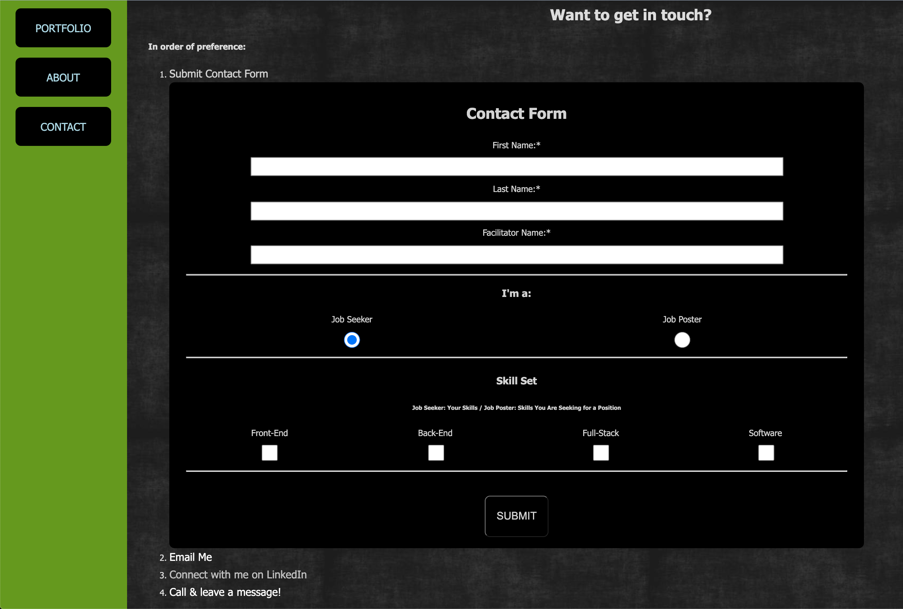

# CS601_HW4_goudy

Added a contact form with error validation per assignment 4 guidelines.
Added a Hamburger menu for mobile viewing with a drop down submenu.
Dropped in a few portfolio items with links to their end product, I'll add a link to source code for the final project.
Reworked the calculator function (and moved to the bottom of the homepage)- from assgn 3.
